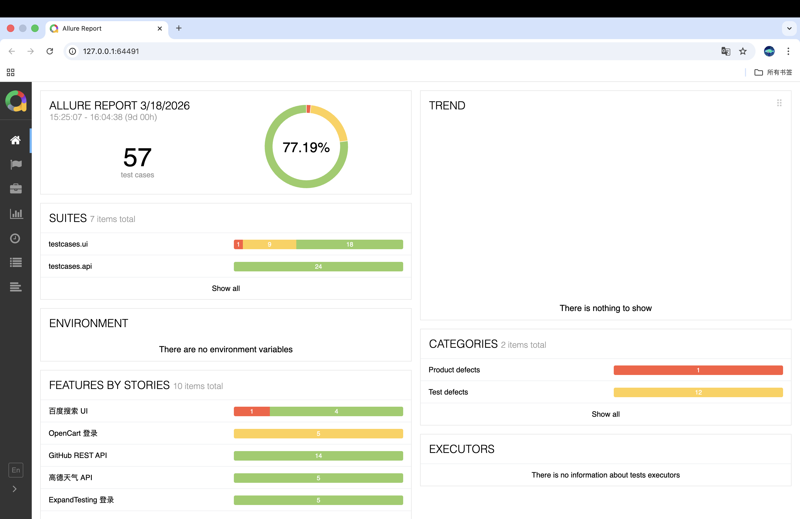
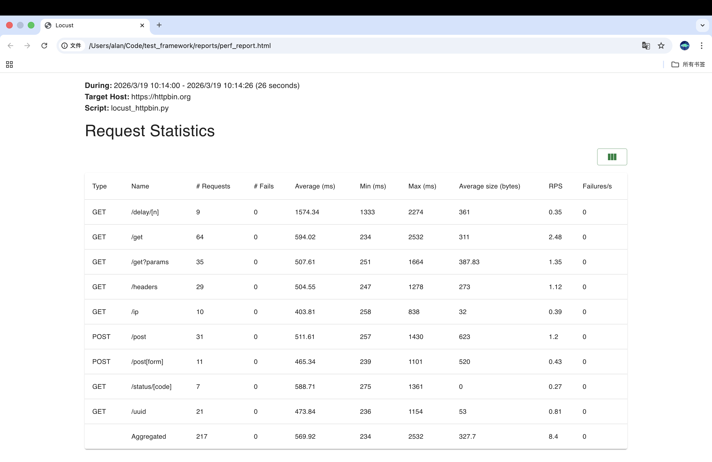
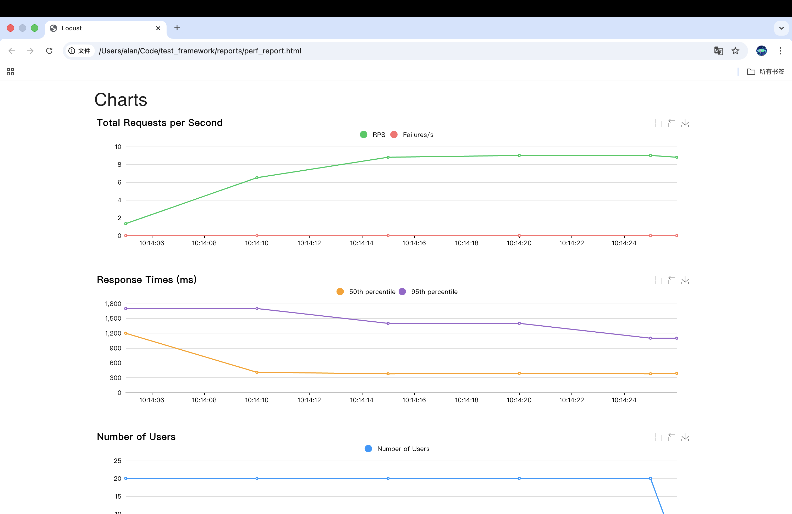

#  Web AutoTest Framework

> 一个基于 **Pytest + Playwright + Requests + Allure** 的 Web 端到端自动化测试框架
> 覆盖 UI 自动化、接口测试、数据驱动、失败截图、CI/CD 全链路实践





## 性能测试报告

> 测试目标：httpbin.org | 并发用户数：10 | 持续时间：26s

### 请求统计



### 响应时间趋势


结论：10并发下失败率为0，平均响应时间500ms左右，系统表现稳定。
---

## 框架架构

```
web-autotest-framework/
├── core/                    # 框架核心层
│   ├── base_page.py         # UI POM 基类（封装 Playwright 操作）
│   └── http_client.py       # 接口请求封装（Session / 断言 / 日志）
├── pages/                   # 页面对象层
│   ├── baidu_page.py        # 百度搜索页面对象
│   └── opencart_login_page.py # OpenCart 登录页面对象
├── testcases/               # 测试用例层
│   ├── ui/
│   │   ├── test_baidu.py    # 百度 UI 测试（参数化 / 截图）
│   │   └── test_opencart_login.py # OpenCart 登录测试
│   └── api/
│       ├── test_weather.py  # 高德天气接口测试
│       └── test_github.py   # GitHub API 测试
├── data/
│   ├── test_data.yaml       # 测试数据配置
│   └── opencart_login.yaml  # OpenCart 登录测试数据
├── utils/
│   ├── faker_helper.py      # Mock 数据生成
│   └── logger.py            # 统一日志
├── perf/
│   └── locust_httpbin.py    # 性能压测脚本
├── docs/
│   ├── allure_report.png    # Allure 报告截图
│   ├── perf_stats.png       # 性能测试统计截图
│   ├── perf_time_stats.png  # 性能测试时间统计截图
│   └── perf_charts.png      # 性能测试图表截图
├── .github/workflows/
│   └── autotest.yml         # GitHub Actions CI 配置
├── conftest.py              # 全局 Fixture + 失败自动截图
├── pytest.ini               # Pytest 配置
└── requirements.txt
```

---

## 框架特性

| 特性 | 说明 |
|------|------|
| POM 设计模式 | 页面与用例解耦，维护成本低 |
| 数据驱动 | YAML + Parametrize，用例与数据分离 |
| 失败自动截图 | 用例失败时自动截图并附加到 Allure 报告 |
| 接口断言封装 | 统一状态码 / 字段断言，减少重复代码 |
| Allure 可视化报告 | 包含步骤、截图、请求/响应详情 |
| 性能测试 | 基于 Locust 的并发压测，支持 HTML 报告生成 |
| CI/CD | GitHub Actions 自动触发，结果发布至 GitHub Pages |
| Mock 数据 | 基于 Faker 生成中文测试数据 |

---

## 快速上手

### 1. 克隆项目

```bash
git clone https://github.com/your-username/web-autotest-framework.git
cd web-autotest-framework
```

### 2. 安装依赖

```bash
pip install -r requirements.txt
playwright install chromium
```

### 3. 配置 API Key（接口测试需要）

在 `testcases/api/test_weather.py` 中替换：
```python
AMAP_KEY = "your_amap_key_here"  # 前往 https://lbs.amap.com 免费注册
```

### 4. 运行测试

```bash
# 运行全部测试
pytest

# 只运行 UI 测试
pytest testcases/ui -v

# 只运行接口测试
pytest testcases/api -v

# 运行并生成 Allure 报告
pytest --alluredir=reports/allure-results
allure serve reports/allure-results
```

---

## 测试报告示例

运行后执行 `allure serve reports/allure-results` 可查看如下报告：

- 测试用例通过/失败统计
- 失败截图自动附加
- 接口请求/响应详情
- 每次 CI 运行历史趋势

---

## 测试用例覆盖

### UI 测试

#### 百度搜索

| 用例 | 场景 |
|------|------|
| test_search_returns_results | 正常关键词搜索，数据驱动 4 组 |
| test_homepage_title | 首页标题包含"百度" |
| test_search_input_visible | 搜索框/按钮可见性 |
| test_special_character_search | 特殊字符不崩溃 |
| test_search_with_screenshot | 搜索截图存档 |

#### OpenCart 登录

| 用例 | 场景 |
|------|------|
| test_login_success | 正常登录成功 |
| test_login_empty_username | 空用户名登录 |
| test_login_empty_password | 空密码登录 |
| test_login_invalid_credentials | 无效凭据登录 |

### 接口测试

#### 高德天气 API

| 用例 | 场景 |
|------|------|
| test_get_weather_success | 多城市数据驱动查询 |
| test_response_fields_completeness | 响应字段完整性 |
| test_invalid_city_code | 无效城市编码容错 |
| test_missing_api_key | 缺少 Key 鉴权校验 |
| test_forecast_weather | 预报天气查询 |

#### GitHub API

| 用例 | 场景 |
|------|------|
| test_get_repos | 获取用户仓库列表 |
| test_get_user_info | 获取用户信息 |
| test_repo_not_found | 仓库不存在 |

---

## 性能测试

### 测试目标
- **httpbin.org**：稳定公开服务，无鉴权，适合并发基准测试
- **GitHub API**：只读接口（匿名限速 60次/小时，作为补充场景）

### 测试场景
- **GET 请求**：基础 GET、带参数 GET、UUID 生成、请求头回显、IP 获取
- **POST 请求**：JSON 格式提交、表单格式提交
- **状态码验证**：验证 200 状态码返回
- **延迟场景**：模拟 1 秒延迟接口，测试超时容忍度

### 运行方式
```bash
# 无头批量模式，自动生成 HTML 报告
locust -f perf/locust_httpbin.py --headless \
  -u 20 -r 5 -t 30s \
  --html reports/perf_report.html \
  --host https://httpbin.org
```

### 参数说明
- `-u`：并发用户数
- `-r`：每秒用户增长速率（ramp-up）
- `-t`：测试持续时间
- `--html`：HTML 报告输出路径

---

## 技术栈

- **Python 3.12**
- **Pytest 9.0.2** — 测试框架（Fixture / Parametrize / Hook）
- **Playwright** — 现代 UI 自动化
- **Requests** — HTTP 接口测试
- **Allure** — 可视化测试报告
- **Faker** — Mock 数据生成
- **Locust** — 性能压测工具
- **GitHub Actions** — CI/CD 自动化

---
